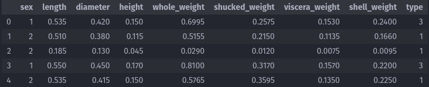
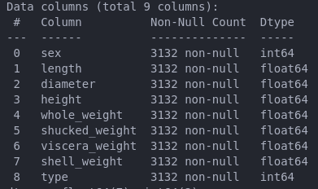
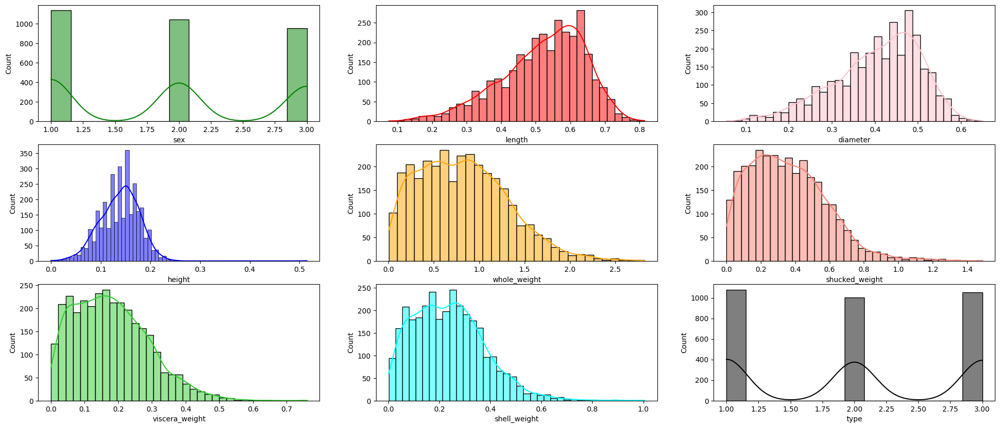
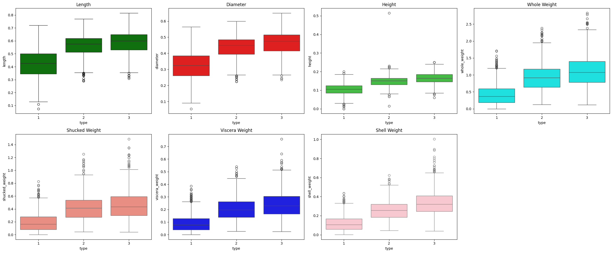
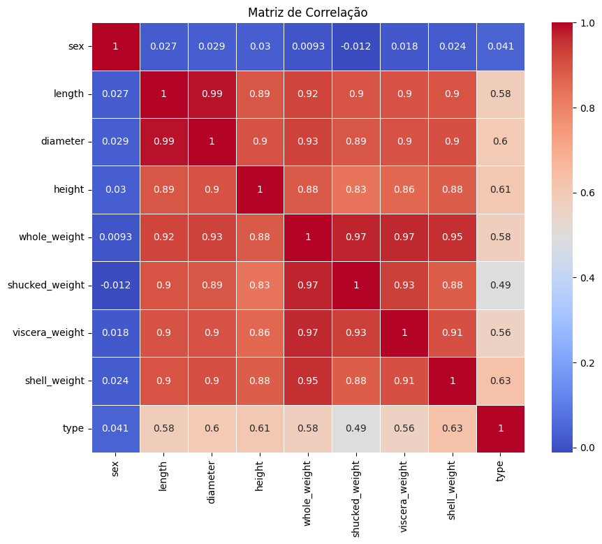

# Além da Concha: Classificação de Abalone Utilizando Aprendizado de Máquina

## Sobre o Abalone
O Abalone é um molusco gastrópode marinho, conhecido pela sua concha única e carne valorizada na gastronomia. Pertencente ao gênero *Haliotis*, o Abalone habita águas costeiras em várias partes do mundo e é conhecido por diferentes nomes culturalmente. Na biologia e na ecologia marinha, o Abalone é objeto de estudo devido à sua importância tanto na cadeia alimentar quanto na pesca comercial. Este projeto busca explorar as características biológicas do Abalone, utilizando métodos de aprendizado de máquina para classificar diferentes tipos desta espécie, com base em atributos morfológicos e físicos.

## Sobre o Problema

Este projeto utiliza um conjunto de dados modificado, originado a partir do UCI Machine Learning Repository: Abalone Data Set. O conjunto original foi adaptado e refinado com o objetivo de aprimorar a análise e a precisão do modelo de classificação. 

Nosso principal objetivo é desenvolver um modelo de aprendizado de máquina capaz de prever com eficácia o 'type' do Abalone (entre as classes I, II e III) utilizando as informações fornecidas em [data](/data).

Atributos do dataset:
- Sex: M, F e I (infantil)
- Length: maior medida em mm da concha
- Diameter: diametro em mm perpendicular a medida Length
- Height: altura em mm com a carne dentro da concha
- Whole weight: peso em gramas de toda a abalone
- Shucked weight: peso em gramas da carne
- Viscera weight: peso em gramas das víceras após escorrer
- Shell weight: peso em gramas para a concha após estar seca
- Type: variável de classe (1, 2 ou 3) para o abalone

## Visualização Dos Dados

### Dataframe
Como podemos observar não temos dados NAN.

### Histogramas
Analize indespensavel para compriender melhor como está distribuido as variaveis da base, se isso está se dando de maneira uniforme o que pode influenciar na seleção de um classificador e identificar outlines.

### Graficos De Dispersão

### Distribuição e Variação das Dimensões Físicas e Peso do Abalone por Tipo
Analize crucial para detecção de caracteristica que podem ser essenciais para a determinação do tipo do abalone.

### Hotmap
Note que as correlações são esperadas em virtude da natureza das variaveis que são medidas do abalone em sua maioria.

## Considerações Iniciasis 

## Modelos De Apredisagem Utilizados 

### Falando Um Pouco Sobre SVM

### Falando Um Pouco Sobre Rando florestes

## Tratamento Dos Dados 

## Resultados Obtidos

## Extra

### T-SNE

### GridSearchCV

## Referências

- WIKIPÉDIA. *Haliotis*. Disponível em: <https://pt.wikipedia.org/wiki/Haliotis>.
- kaggle. Disponível em: <https://www.kaggle.com/code/sanchitvj/abalone-age-prediction/notebook>
